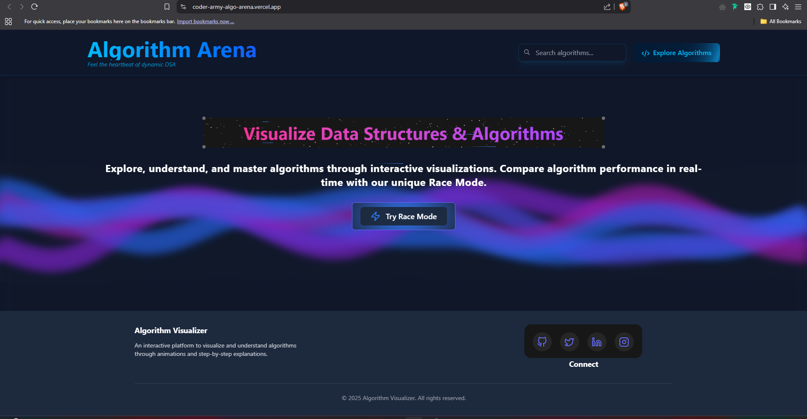
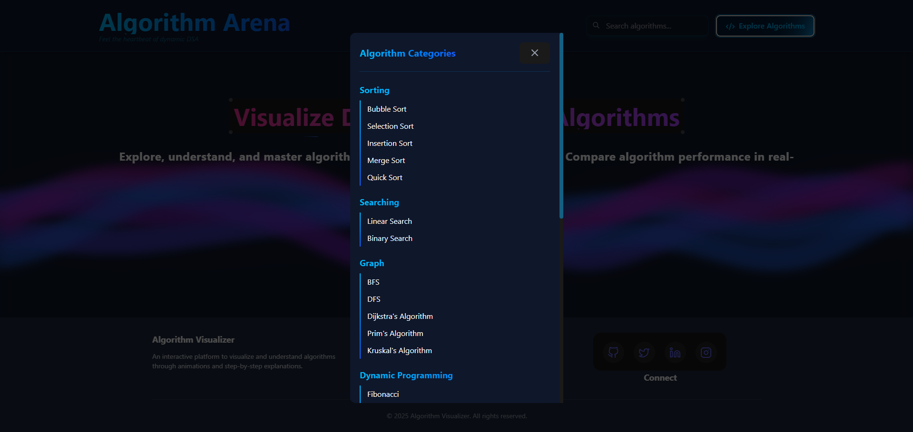
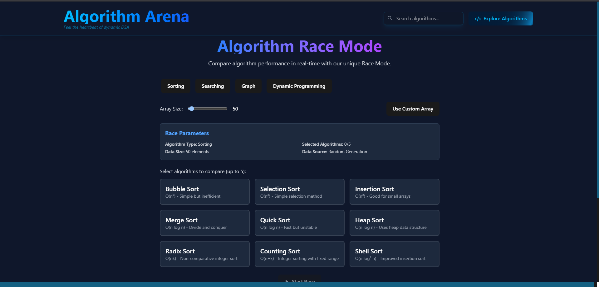

<div align="center">
  

  <h2>Experience Algorithm Efficiency Through Real-Time Racing – Built with React</h2>
</div>

---


## 🚀 Overview

**AlgoLens** is an engaging, visual-first platform designed to showcase algorithm performance by racing them against each other in real time. It’s a hands-on way to explore computational efficiency and complexity concepts.

## ✨ Core Highlights

### 🏎️ Real-Time Algorithm Races

- Instantly compare algorithms head-to-head
- Animated race progress visuals
- Tracks execution steps and time metrics
- Flexible input size configuration

### 📈 In-Depth Analytics

- Relative efficiency percentages
- Execution step counter
- Time taken by each algorithm
- Insightful performance summaries

### ⚙️ User-Customizable Controls

- Choose from multiple algorithm types
- Set your own input and race parameters
- View live updates throughout the race
- Access detailed reports after each run

## 🛠️ Getting Started

```bash
# Clone the project
git clone https://github.com/yourusername/CoderArmy-AlgoArena.git

# Move into project folder
cd AlgoLens

# Install required packages
npm install

# Start development server
npm run dev
```

## 💡 How to Use

### Initiate a Race

1. Select two or more algorithms
2. Customize input data and parameters
3. Hit "Start Race" and watch the action
4. Examine the winner and performance details


## 🔧 Tech Stack

- **React 18**
- **Vite**
- **Tailwind CSS**
- **Framer Motion**
- **React Router**


## 🖼️ Screenshots

<div align="center">
  <div style="display: flex; flex-wrap: wrap; gap: 10px; justify-content: center;">
    
    
    
    
  </div>
</div>

---

<div align="center">
  Built with ❤️ by <a href="https://github.com/atul21mangla">Atul Mangla</a>
</div>
